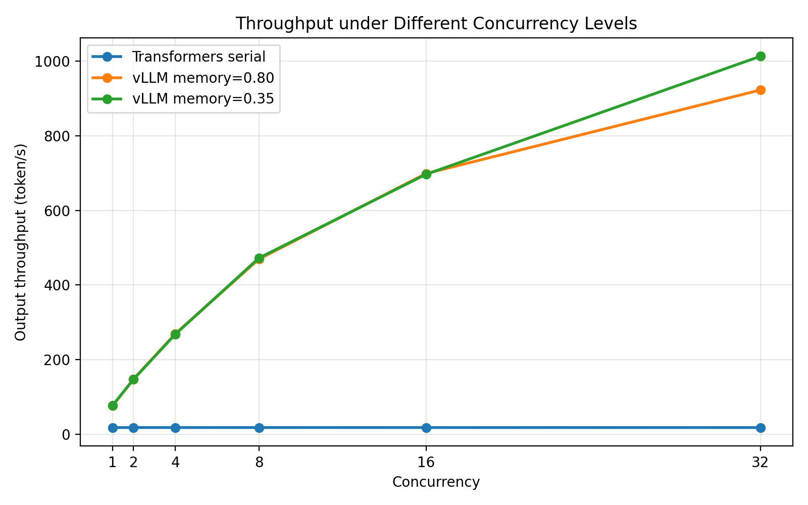
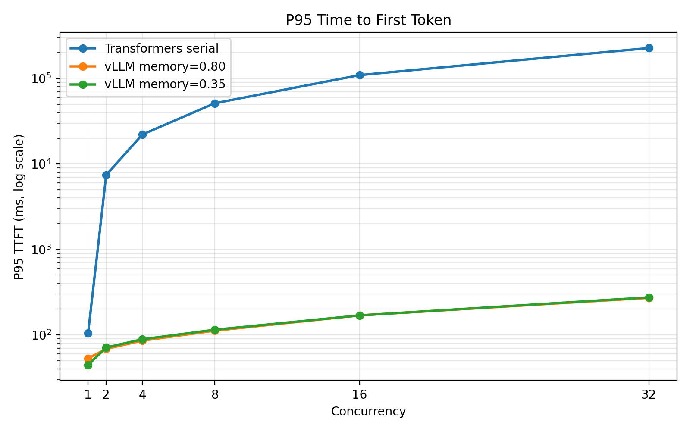
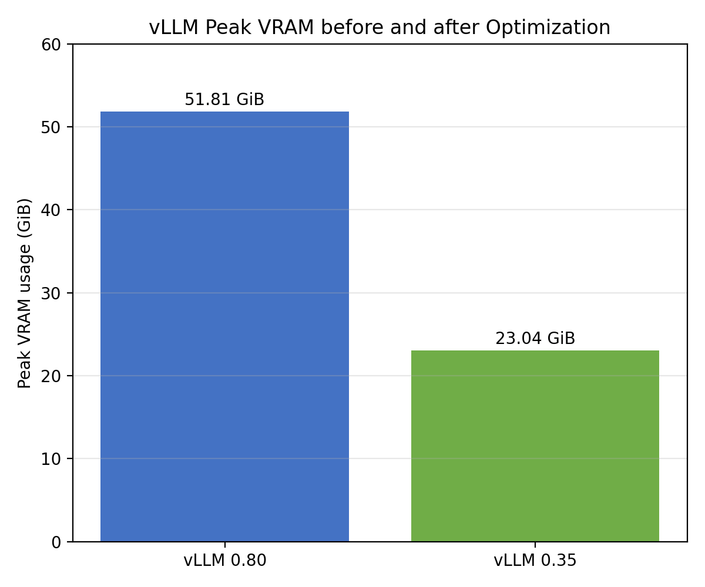

# Qwen3-1.7B vLLM 推理基准与显存优化

在单张海光 `K500SM_AI` DCU 上部署 Qwen3-1.7B，对比简单串行
Transformers 在线服务与 vLLM 的推理性能，并通过调整 KV Cache 预留比例优化
vLLM 显存占用。仓库保留测试脚本、原始结果、汇总数据和可视化，便于复核。

## 核心结果

- 单并发：vLLM 输出吞吐 `76.11 token/s`，为串行 Transformers 基线的
  `4.34×`。
- 并发 32：vLLM 输出吞吐达到 `923.12 token/s`；优化配置达到
  `1013.50 token/s`。
- 将 `gpu_memory_utilization` 从 `0.80` 调整至 `0.35` 后，峰值显存从
  `51.81 GiB` 降至 `23.04 GiB`，下降 `55.52%`。
- 优化前后并发 1～16 的吞吐变化均小于 `1%`，P95 TTFT 未出现明显退化。
- 三组配置各完成 23 个测试组、1150 个请求，未记录请求错误。







## 实验配置

|项目|配置|
|---|---|
|模型|Qwen3-1.7B|
|设备|单张 K500SM_AI（服务器共 4 张）|
|精度|BF16|
|vLLM|0.11.0 海光 DTK 定制版本|
|PyTorch|2.5.1 海光 DTK 定制版本|
|最大上下文|4096 Token|
|随机种子|42|
|每组请求|50|
|并发实验|1/2/4/8/16/32，各重复 3 次|

测试矩阵还包括：输入长度 128/1024/2048 的 Prefill 测试，以及输出长度
64/256 的 Decoding 测试。

## 主要结果

|并发|Transformers tok/s|vLLM 0.80 tok/s|vLLM 0.35 tok/s|
|---:|---:|---:|---:|
|1|17.53|76.11|76.82|
|2|17.64|147.34|147.01|
|4|17.63|269.06|267.74|
|8|17.64|469.46|472.25|
|16|17.62|698.94|696.90|
|32|17.54|923.12|1013.50|

高并发下的巨大差距主要来自 Transformers 基线串行排队与 vLLM 连续批处理
之间的服务架构差异，不能解释为底层计算内核获得了相同倍数的加速。完整口径见
[测试方法](docs/benchmark_methodology.md)。

## 仓库结构

```text
.
├── docs/           # 方法、复现步骤和实验结论
├── figures/        # 性能与显存图表
├── results/
│   ├── raw/        # vLLM bench 原始 JSON
│   └── *.csv       # 汇总和对比结果
├── scripts/        # 服务、测试、汇总和绘图脚本
├── verification/   # 环境与结果完整性记录
└── README.md
```

## 快速复现

推理环境必须安装与目标硬件匹配的 PyTorch、Transformers 和 vLLM。本项目实验使用
组织提供的海光 DTK 定制镜像，不建议用普通 CUDA/PyPI 软件包覆盖硬件定制组件。

```bash
export MODEL_PATH=/path/to/Qwen3-1.7B
export HIP_VISIBLE_DEVICES=0
export ROCR_VISIBLE_DEVICES=0
```

启动优化版 vLLM：

```bash
GPU_MEMORY_UTILIZATION=0.35 bash scripts/serve_vllm.sh
```

在另一个终端运行测试：

```bash
bash scripts/run_vllm_mem035_benchmark.sh
```

基线配置将参数改为 `0.80`，并运行 `scripts/run_vllm_benchmark.sh`。Transformers
串行基线通过 `python scripts/transformers_server.py` 启动。完整操作见
[复现指南](docs/reproduction.md)。

已有原始结果可直接重新汇总和绘图：

```bash
python -m pip install -r requirements-analysis.txt
bash scripts/run_analysis.sh
```

## 文档

- [测试方法与公平性边界](docs/benchmark_methodology.md)
- [完整复现步骤](docs/reproduction.md)
- [最终实验结论](docs/final_findings.md)
- [Transformers 与 vLLM 明细](docs/engine_comparison_initial.md)
- [vLLM 显存优化明细](docs/vllm_memory_optimization_findings.md)

## 许可与说明

仓库中的自编脚本和文档使用 MIT License。模型权重未包含在仓库中，其许可证以
模型发布方说明为准。测试结果仅代表本次硬件、软件版本和测试矩阵。

